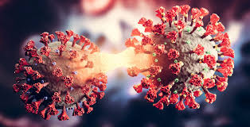

# 🦠 COVID-19 Classification

<center>
    
</center>

## Introduction
This project focuses on utilizing transfer learning with a fine-tuned deep convolutional neural network (CNN) based on the ResNet50 architecture to classify COVID-19 from chest X-ray images. By leveraging a pre-trained ResNet50 model, we aim to improve the accuracy and efficiency of detecting COVID-19, making it a valuable tool in medical diagnostics.

## Requirements
- Python 3.9+
- `numpy==1.26.4`
- `scikit-learn==1.3.1`
- `matplotlib==3.8.4`
- `pandas==2.2.1`


## Installation
1. Clone the repository
```
https://github.com/DeepAxion/covid-19-classification.git

cd covid-19-classification

```

2. Install required packages
```
pip install -r requirements.txt

```

## Data 
The dataset used in this project is the COVID 19 Radiography Dataset comprising of chest X-ray images, including both COVID-19 positive and negative cases. 

<center>
    
</center>

## Model Performance

Another thing we will define is the metrics to evaluate our model. We will not use accuracy as our metric as it is not ideal when dealing with imbalanced dataset. To understand why, let’s assume we have a dataset where there is 9 examples in Class A and 1 example in Class B. Now even if our model is poor, it has 90% chances of choosing correct class which means it can have 90% accuracy. It is obviously misleading in terms of analyzing our model. Thus we will use another pair of metric called sensitivity and specificity.

**Sensitivity** (also called the true positive rate, the recall) measures the proportion of actual positives that are correctly identified as such (e.g., the percentage of sick people who are correctly identified as having the condition).

**Specificity** (also called the true negative rate) measures the proportion of actual negatives that are correctly identified as such (e.g., the percentage of healthy people who are correctly identified as not having the condition).

   1. Overall performace:</br>
    **Sensitivity: 0.919** </br>
    **Specificity: 0.956**

   2. Confusion matrix
<center>

</center>

   3. ROC CURVE
<center>

</center>

## Results
The fine-tuned ResNet50 model achieves high accuracy in classifying COVID-19 from chest X-ray images. Detailed results include precision, recall, and F1-score metrics, highlighting the model's capability to distinguish between COVID-19 and non-COVID cases effectively.

**Note:** The model currently exhibits a high Type II error rate, meaning there is a higher occurrence of false negatives. This is a critical consideration, as misclassifying COVID-19 positive cases as negative could have severe consequences. Future work will focus on reducing Type II errors to improve the model's sensitivity.

## Conclusion
This project demonstrates the efficacy of using transfer learning with the ResNet50 model for medical image classification tasks. The approach provides a promising solution for rapid and accurate COVID-19 detection, which can be further refined and deployed in clinical settings.

